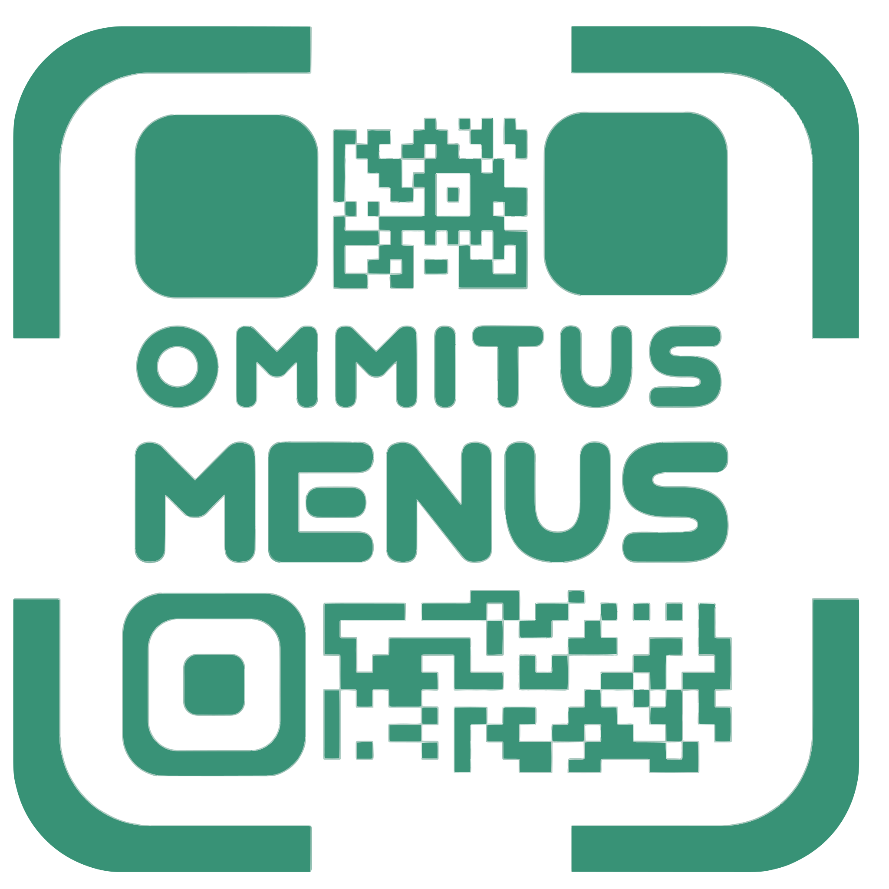

# Ommitus

**Ommitus** is a SaaS platform that provides digital menus for restaurants, accessible via QR code scanning. Designed for modern restaurants, Ommitus helps streamline menu management and enhance customer experience.

## How it started?

I was sitting in a fancy restaurant where I saw a digital menu, which was a canva template uploaded on google drive and the URL was provided in a QR code. Everything was so static and the idea just flashed in my mind that "I can make it BETTER"...

---

## The logo

<!-- Add screenshots or demo GIFs here -->

## 🚀 Features

- Digital menus accessible by QR code
- Easy menu management for restaurant owners
- Customer-friendly interface
- Startup-ready architecture
- Built with modern web technologies

---

## 🛠️ Tech Stack

- **Frontend:** React, Vite (v1), Next.js (v2)
- **Backend:** Express.js(JS) (v1), Express.js(TS) (v2)
- **Database:** (Mongodb and Supabase)
- **Deployment:** Cloudflare and AWS

---

---

## 📖 About

Ommitus was originally built in 2024 using React, Vite, and Express.js. The project is now being reimagined with more sophisticated tech stacks, including Next.js and NestJS, to deliver a robust and scalable solution for restaurants. 

---

## 👤 Author

- **Saumya Kanti Sarma**
---